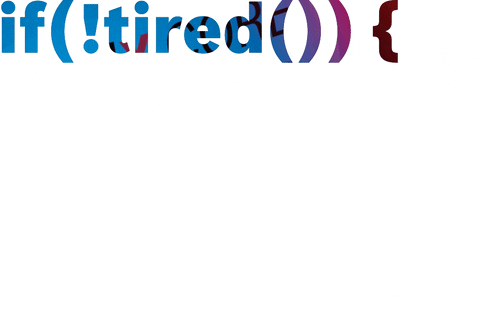

  

  

<h1 align="center">Hello <𝚌𝚘𝚍𝚎𝚛𝚜/>!, I'm <a href="https://github.com/Sukhendra523">Sukhendra Rajawat</a>
</h1>
<h3 align="center">A passionate MERN Stack developer from India</h3>

  
  
  
 

  

  

- 👨🏻‍💻 I’m an **Front-End Developer**

- 🛠️ My current stack is **MERN**
  
- 👨‍💻 All of my projects are available at (https://sukhendra523.github.io/)

- 💬 Ask me about **Front End Development**

- 🔭 I’m currently working on [Python-for-data-science](https://github.com/Sukhendra523/Cognitiveclass-python-for-data-science)

- 👯 I’m looking to collaborate on [Python-for-data-science](https://github.com/Sukhendra523/Cognitiveclass-python-for-data-science)

- 📫 How to reach me **523sukhendra@gmail.com**

- 📄 Know about my experiences [https://sukhendra523.github.io/]

  
<h3 align="left">Connect with me:</h3>

 

 
  
  
  
  
  

 

### ✍️ Quote Of The Day

  
  

